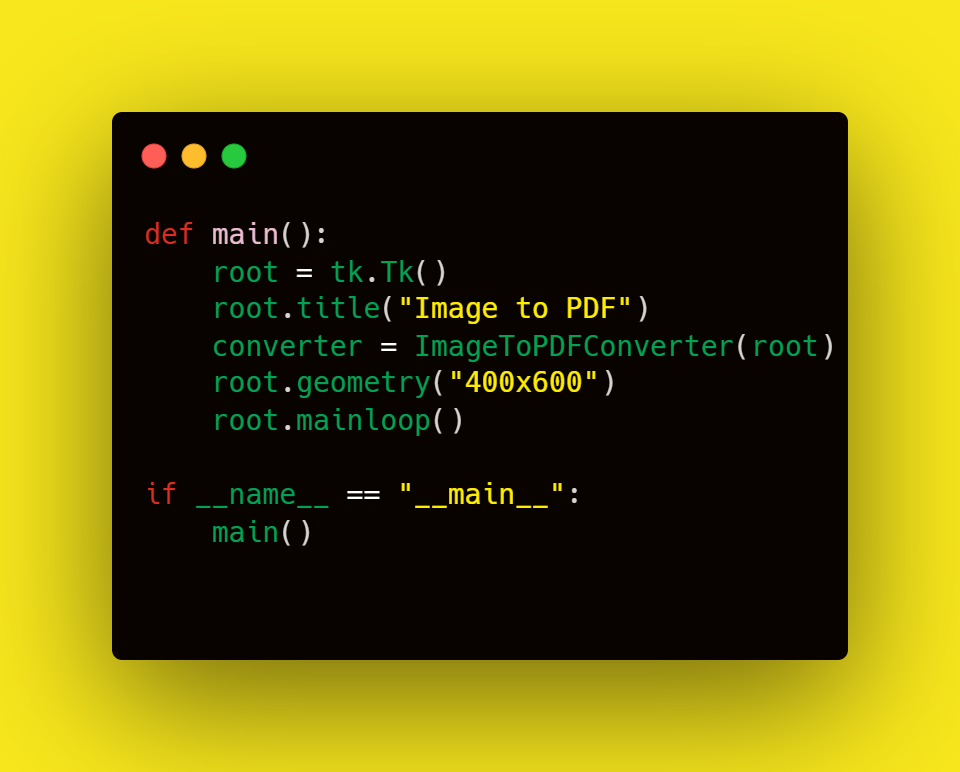

# Image to PDF Converter


## Overview
The **Image to PDF Converter** is a Python-based GUI application that allows users to easily convert a collection of images into a single PDF file. This tool provides a convenient interface for selecting multiple images, arranging them, and generating a neatly formatted PDF document. It is built using the `tkinter` library for the graphical interface and uses `Pillow` and `reportlab` libraries for image processing and PDF generation, respectively.

---

## Features
- **User-Friendly Interface**: A simple and intuitive GUI for quick and easy operation.
- **Multi-Image Selection**: Add multiple images at once for conversion.
- **Customizable Output File Name**: Specify a name for the generated PDF.
- **Automatic Image Scaling**: Automatically adjusts image dimensions to fit the PDF page while maintaining aspect ratio.
- **Cross-Platform Compatibility**: Works on any platform where Python and required libraries are supported.

---

## Prerequisites
Make sure to have the following Python libraries installed:
- [Tkinter](https://docs.python.org/3/library/tkinter.html) (comes pre-installed with Python for most systems)
- [Pillow](https://pypi.org/project/Pillow/)
- [ReportLab](https://pypi.org/project/reportlab/)

You can install the required dependencies using `pip`:
```bash
pip install pillow reportlab
```

---

## How It Works
### 1. User Interface
The application window consists of:
- **Title Label**: Displays "Image to PDF Converter".
- **Select Images Button**: Opens a file dialog for the user to select images (`.png`, `.jpg`, `.jpeg`).
- **Listbox**: Displays the names of the selected images.
- **Output PDF Name Input**: Allows the user to specify a custom name for the output PDF.
- **Convert to PDF Button**: Generates the PDF document using the selected images.

### 2. Core Functionality
- **Image Selection**: Users can select multiple images via a file dialog, and the file names are displayed in the Listbox.
- **Conversion Process**: Images are added to a PDF with automatic resizing to fit the page dimensions (612x792 points, equivalent to 8.5x11 inches).
- **Output PDF**: The generated PDF is saved with the user-specified name or defaults to `output.pdf`.

---

## Code Explanation

### Class: `ImageToPDFConverter`
This class encapsulates the entire functionality of the application.

#### **Initialization (`__init__`)**
- Initializes the main components of the GUI, such as the Listbox for displaying selected images and an input field for the PDF name.
- Calls `initialize_UI()` to set up the layout and widgets.

#### **Method: `initialize_UI`**
- Creates and organizes the graphical components:
  - Labels, buttons, Listbox, and input field.
- Sets up event handling for user interactions.

#### **Method: `select_images`**
- Opens a file dialog to select images.
- Updates the Listbox with the names of the selected images.

#### **Method: `update_selected_images_listbox`**
- Refreshes the Listbox to show the file names of the currently selected images.

#### **Method: `convert_images_to_pdf`**
- Converts the selected images into a PDF:
  - Opens each image using `Pillow` and calculates the scaling factor to fit the image within the available space.
  - Adds the image to a blank PDF page at a centered position.
  - Saves the PDF with the user-specified name or a default name (`output.pdf`).

---

## Example Usage

### Running the Application
To run the application, simply execute the script:
```bash
python script_name.py
```

### Steps:
1. Click the **"Select Images"** button to choose images.
2. Enter a name for the output PDF in the text field (optional).
3. Click the **"Convert to PDF"** button to generate the PDF.

---

## Code Structure
### Main Code



- Initializes the `tkinter` root window.
- Instantiates the `ImageToPDFConverter` class and starts the event loop.

---

## Output
- The generated PDF will contain one image per page, scaled to fit within 540x720 points while maintaining its aspect ratio.
- The PDF is saved in the current working directory with the name specified by the user or defaults to `output.pdf`.

---

## Dependencies
- `tkinter`: For creating the GUI.
- `Pillow`: For opening and processing images.
- `reportlab`: For creating the PDF.

---

## Customization
You can customize the following aspects of the application:
- **Page Size**: Modify the `pagesize` parameter in the `canvas` initialization to use a different PDF page size.
- **Image Scaling**: Adjust the `available_width` and `available_height` values to change the scaling behavior.

---

## Known Limitations
- Only supports `.png`, `.jpg`, and `.jpeg` file formats.
- All images are added to the PDF in the order they are selected.
- Does not allow rearranging the images after selection.

---

## Screenshots (Optional)
### Main Window
_A sample interface of the application._

---

## Acknowledgments
This tool is built on powerful Python libraries like `tkinter`, `Pillow`, and `reportlab`, making it a simple yet robust solution for image-to-PDF conversion.
